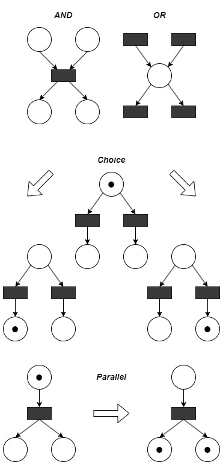

# Laboratory works with MPI (Message Passing Interface)

> Download `msmpisdk.msi` and `msmpisetup.exe` from
> [Microsoft-MPI](https://github.com/microsoft/Microsoft-MPI/releases).
>
> Set correct paths in [CMakeLists.txt](CMakeLists.txt).

- lab 1
    - Program: [lab1.c](lab1.c)
    - Output: [lab1.output.txt](lab1.output.txt)
    - Elapsed time: [lab1.time.txt](lab1.time.txt)
    - Program with ordered output: [lab1sync.c](lab1sync.c)
- lab 2
    - Program: [lab2.c](lab2.c)
    - Output: [lab2.output.txt](lab2.output.txt)
    - Elapsed time: [lab2.benchmark.txt](lab2.benchmark.txt)
    - Benchmark runner: [lab2.runner.bat](lab2.runner.bat)
- lab 3
    - Program: [lab3.c](lab3.c)
    - Output: [lab3.output.txt](lab3.output.txt)
    - Elapsed time: [lab3.benchmark.txt](lab3.benchmark.txt)
    - Benchmark runner: [lab3.runner.bat](lab3.runner.bat)
- lab 4
    - Program: [lab4.c](lab4.c)
    - Output: [lab4.output.txt](lab4.output.txt)
    - Elapsed time: [lab4.benchmark.txt](lab4.benchmark.txt)
    - Benchmark runner: [lab4.runner.bat](lab4.runner.bat)

## [Petri net](https://en.wikipedia.org/wiki/Petri_net)

